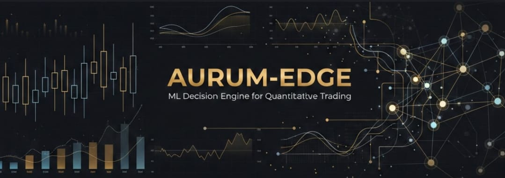

# 🚀 AURUM-EDGE — ML Decision Engine (Quant Trading)
### *Motor profesional de decisión ML para Trading Cuantitativo*

[](https://www.python.org/downloads/)
[](https://xgboost.ai/)
[](https://optuna.org/)
[]()
[]()
[]()
[]()

---

## ⚠️ DISCLAIMER LEGAL

**ESTO NO ES ASESORÍA FINANCIERA NI GARANTÍA DE GANANCIAS.**

- El trading de instrumentos financieros conlleva riesgo significativo de pérdida de capital.
- Este software es educacional y experimental. NO lo uses con dinero real sin entender completamente los riesgos.
- Los resultados pasados NO garantizan resultados futuros.
- Eres 100% responsable de tus decisiones de trading.
- LIA Engineering Solutions NO se hace responsable de pérdidas financieras.

**Usa SOLO en paper trading hasta que demuestres proficiencia completa.**

---

## 🎯 Qué hace este sistema

AURUM-EDGE v2 es un pipeline completo de machine learning para trading que:

1. **Ingesta datos** exportados desde MT5 (formato CSV)
2. **Valida calidad** de datos (gaps, outliers, monotonicidad)
3. **Genera features** sin data leakage (returns, volatility, trend, microestructura)
4. **Etiqueta** con triple-barrier usando ATR (TP/SL/time)
5. **Entrena modelos** XGBoost con hyperparameter tuning (Optuna) + calibración
6. **Valida** con walk-forward (no cross-validation aleatorio)
7. **Decide** con política tipo value trading (thresholds dinámicos)
8. **Gestiona riesgo** para cuentas pequeñas (daily loss, cooldown, kill switch)
9. **Ejecuta paper trading** con costos realistas (spread + slippage)
10. **Requiere aprobación humana** antes de señales (human-in-the-loop)

---

## 📋 Requisitos previos

- **Mac con Apple Silicon (M1/M2/M3)** o Intel (el proyecto está optimizado para Mac)
- **Python 3.11+** (3.12 recomendado)
- **8GB RAM mínimo** (16GB recomendado para datasets grandes)
- **Terminal MetaTrader 5** instalado (para exportar datos)
- **5GB espacio en disco** (para datos + modelos)

---

## 🚀 Instalación paso a paso (para principiantes)

### Paso 1: Instalar Homebrew

Abre la Terminal (busca "Terminal" en Spotlight con Cmd+Space) y ejecuta:

```bash
/bin/bash -c "$(curl -fsSL https://raw.githubusercontent.com/Homebrew/install/HEAD/install.sh)"
```

Sigue las instrucciones en pantalla. Al final, ejecuta los comandos que te indique para añadir Homebrew al PATH.

### Paso 2: Instalar Python 3.11+

Opción A - Con Homebrew (más simple):
```bash
brew install python@3.11
```

Opción B - Con pyenv (recomendado para múltiples versiones):
```bash
brew install pyenv
echo 'export PYENV_ROOT="$HOME/.pyenv"' >> ~/.zshrc
echo 'command -v pyenv >/dev/null || export PATH="$PYENV_ROOT/bin:$PATH"' >> ~/.zshrc
echo 'eval "$(pyenv init -)"' >> ~/.zshrc
source ~/.zshrc
pyenv install 3.11.7
pyenv global 3.11.7
```

Verifica la instalación:
```bash
python3 --version  # Debe mostrar Python 3.11.x o superior
```

### Paso 3: Descargar el proyecto

```bash
cd ~/Documents  # O donde quieras guardar el proyecto
# Si tienes el proyecto en zip, descomprímelo aquí
# Si está en git: git clone <url-repo> aurum-edge
cd aurum-edge
```

### Paso 4: Crear entorno virtual

```bash
python3 -m venv venv
source venv/bin/activate  # Tu terminal mostrará (venv) al inicio
```

**IMPORTANTE**: Cada vez que abras una nueva terminal, debes activar el entorno con:
```bash
cd ~/Documents/aurum-edge
source venv/bin/activate
```

### Paso 5: Instalar dependencias

```bash
make setup
```

Este comando:
- Actualiza pip
- Instala todas las dependencias del proyecto
- Instala pre-commit hooks para calidad de código
- Crea carpetas necesarias

### Paso 6: Verificar instalación

```bash
make test
```

Deberías ver tests pasando. Si hay errores, revisa la sección Troubleshooting.

---

## 📊 Exportar datos desde MT5

### En MetaTrader 5:

1. **Abre MT5** y ve al gráfico del activo (ej: NAS100, US100, USTEC)
2. **Cambia timeframe a M5** (click derecho en gráfico → Timeframe → M5)
3. **Exporta datos**:
   - Click derecho en el gráfico
   - "Save As Picture..." → NO, esto no sirve
   - En su lugar: **Tools → History Center** (F2)
   - Selecciona el símbolo (ej: NAS100 o US100)
   - Selecciona M5
   - Click "Export"
   - Guarda como CSV
   
4. **Formato esperado del CSV**:
   ```
   Date,Time,Open,High,Low,Close,TickVolume,Spread
   2024.01.02,00:00,16500.5,16510.2,16498.3,16505.7,1250,2.5
   ```

5. **Copia el CSV** a la carpeta del proyecto:
   ```bash
   cp ~/Downloads/NAS100_M5.csv ~/Documents/aurum-edge/data/raw/nas100_m5.csv
   ```

---

## 🔄 Ejecutar el pipeline completo

### 1. Configurar parámetros

Edita `configs/default.yaml` si quieres cambiar:
- Símbolo del activo
- Parámetros de triple-barrier
- Walk-forward windows
- Risk limits

Por defecto viene configurado para **NAS100 M5** con parámetros conservadores.

### 2. Validar datos

```bash
make validate-data
```

Esto revisa:
- Que el CSV exista
- Gaps temporales
- Outliers
- Monotonicidad de timestamps

### 3. Construir features

```bash
make build-features
```

Genera features técnicos sin data leakage y guarda en `data/features/`.

### 4. Construir labels

```bash
make build-labels
```

Aplica triple-barrier con ATR para calcular TP/SL y genera labels.

### 5. Entrenar modelo

```bash
make train
```

Esto:
- Corre hyperparameter tuning con Optuna (30 trials por defecto)
- Entrena el mejor modelo con XGBoost
- Calibra probabilidades
- Guarda el modelo en `models/`
- Genera reporte de performance

### 6. Backtest walk-forward

```bash
make backtest
```

Ejecuta validación walk-forward (train 3 meses, test 2 semanas, step 2 semanas).
Genera reportes en `reports/walkforward/`.

### 7. Paper trading (simulación)

```bash
make paper
```

Corre paper trading en datos recientes con:
- Costos realistas (spread + slippage)
- Human-in-the-loop (requiere aprobación manual)
- Risk management activo

---

## 🤖 Activar Human-in-the-Loop (Telegram/Discord)

Por defecto, el sistema funciona **sin necesidad de tokens** (modo stub/local).

Para activar notificaciones reales:

### Opción 1: Telegram

1. **Crea un bot**:
   - Habla con @BotFather en Telegram
   - Envía `/newbot` y sigue instrucciones
   - Copia el token que te da

2. **Obtén tu chat ID**:
   - Habla con @userinfobot
   - Copia tu chat ID

3. **Configura**:
   ```bash
   cp .env.example .env
   nano .env  # O usa tu editor favorito
   ```
   
   Añade:
   ```
   TELEGRAM_BOT_TOKEN=tu_token_aqui
   TELEGRAM_CHAT_ID=tu_chat_id_aqui
   ```

4. **Reinicia paper trading**:
   ```bash
   make paper
   ```

### Opción 2: Discord

1. **Crea webhook**:
   - Server Settings → Integrations → Webhooks
   - Create Webhook
   - Copia la URL

2. **Configura**:
   ```bash
   echo "DISCORD_WEBHOOK_URL=tu_url_aqui" >> .env
   ```

---

## 📈 Interpretar reportes

Los reportes se generan en:
- `reports/experiments/`: Cada run de training
- `reports/walkforward/`: Resultados de validación temporal
- `reports/daily/`: Resumen diario de paper trading

### Métricas clave:

- **Profit Factor (PF)**: Ganancia total / Pérdida total. Mínimo aceptable: 1.3
- **Max Drawdown (DD)**: Máxima caída desde peak. Máximo aceptable: -15%
- **Expectancy**: Ganancia promedio por trade. Debe ser > 0
- **Win Rate**: % de trades ganadores. NO es la métrica principal
- **Sharpe Ratio**: Retorno / Volatilidad. Solo referencia secundaria

### 🚨 Gating de modelos:

Un modelo solo se "promociona" a producción si cumple:
```yaml
min_profit_factor: 1.3
max_drawdown: -0.15  # -15%
min_expectancy: 0.0  # Positivo
min_trades: 50
```

Si no pasa, se mantiene el modelo anterior.

---

## 🛠️ Comandos Makefile

```bash
make setup          # Instala dependencias y prepara entorno
make test           # Corre todos los tests
make test-leakage   # Test específico anti-leakage
make lint           # Revisa calidad de código
make format         # Formatea código automáticamente

make validate-data  # Valida CSV raw
make build-features # Genera features
make build-labels   # Genera labels triple-barrier
make train          # Entrena modelo con tuning
make backtest       # Walk-forward validation
make paper          # Paper trading

make clean          # Limpia archivos temporales
make clean-data     # Limpia datos procesados (¡cuidado!)
make clean-models   # Limpia modelos (¡cuidado!)

make help           # Muestra ayuda
```

---

## 🐛 Troubleshooting

### Error: "command not found: make"

**Solución**:
```bash
xcode-select --install
```

### Error: "No module named 'pandas'"

**Solución**:
```bash
source venv/bin/activate
pip install --upgrade pip
make setup
```

### Error: "pyarrow not found" al leer parquet

**Solución**:
```bash
pip install pyarrow fastparquet
```

### Error: "Permission denied" al crear carpetas

**Solución**:
```bash
chmod -R u+w ~/Documents/aurum-edge
```

### Tests fallan con "data leakage detected"

**Esto es CORRECTO**. Significa que el sistema detectó un problema.
**NO lo ignores**. Revisa el código que genera features.

### El modelo no se promociona (gating fails)

**Esto es NORMAL** si la estrategia no es rentable.
No modifiques los thresholds de gating para "forzar" la aprobación.
En su lugar:
1. Revisa la distribución de labels (¿hay suficientes muestras?)
2. Revisa los costos de trading (¿son realistas?)
3. Considera que el modelo puede no tener edge real

---

## 🔧 Configuración avanzada

### Cambiar parámetros de triple-barrier

Edita `configs/labeling/triple_barrier.yaml`:
```yaml
tp_multiplier: 2.0  # TP = 2x ATR
sl_multiplier: 1.0  # SL = 1x ATR
time_bars: 12       # Max holding period (en barras)
atr_period: 14      # Ventana para calcular ATR
```

### Cambiar walk-forward windows

Edita `configs/walkforward/wf_3m_2w.yaml`:
```yaml
train_months: 3
test_weeks: 2
step_weeks: 2
```

### Ajustar risk limits

Edita `configs/risk/micro_account.yaml`:
```yaml
daily_loss_limit: -100.0  # USD
max_trades_per_day: 5
cooldown_after_loss: 3600 # segundos
kill_switch_dd: -0.20     # -20%
```

---

## 📚 Documentación adicional

- `docs/thesis.md`: Fundamentos teóricos de la estrategia
- `docs/architecture.md`: Diseño del sistema
- `docs/operations.md`: Guía operativa diaria
- `docs/api_reference.md`: (Fase 2) Referencia de API

---

## 🚦 Roadmap

### Fase 1 (MVP - ACTUAL):
- ✅ Ingesta y validación de datos
- ✅ Feature engineering anti-leakage
- ✅ Triple-barrier labeling
- ✅ XGBoost con tuning
- ✅ Walk-forward validation
- ✅ Paper trading con costos
- ✅ Risk management micro
- ✅ Human-in-the-loop

### Fase 2 (Producción):
- ⏳ MT5 bridge con ejecución real
- ⏳ Multi-asset support (XAUUSD, EUR/USD)
- ⏳ Adaptive triple-barrier
- ⏳ Ensemble de modelos
- ⏳ Dashboard web (FastAPI + React)
- ⏳ Monitoreo con Prometheus/Grafana

---

## 🤝 Soporte

Para issues técnicos:
1. Revisa la sección Troubleshooting
2. Verifica logs en `logs/`
3. Corre `make test` para diagnóstico
4. Contacta a LIA Engineering Solutions

**Recuerda**: Este es un sistema educacional. Úsalo con responsabilidad.

---

## 📄 Licencia

Proyecto propietario de LIA Engineering Solutions.
No redistribuir sin autorización.

---

## 🙏 Créditos

Desarrollado por LIA Engineering Solutions.
Basado en principios de trading cuantitativo, machine learning y risk management.

## 🔗 Navegación

<p align="center">
  <a href="https://github.com/miller-petit-dev/Nexus-AI-Financial-Data-Pipeline-Insights">
    
  </a>
  &nbsp;&nbsp;
  <a href="https://github.com/miller-petit-dev/LIA-Quantitative-Execution-Framework">
    
  </a>
  &nbsp;&nbsp;
  <a href="https://github.com/Miller-Petit-Dev">
    
  </a>
</p>
